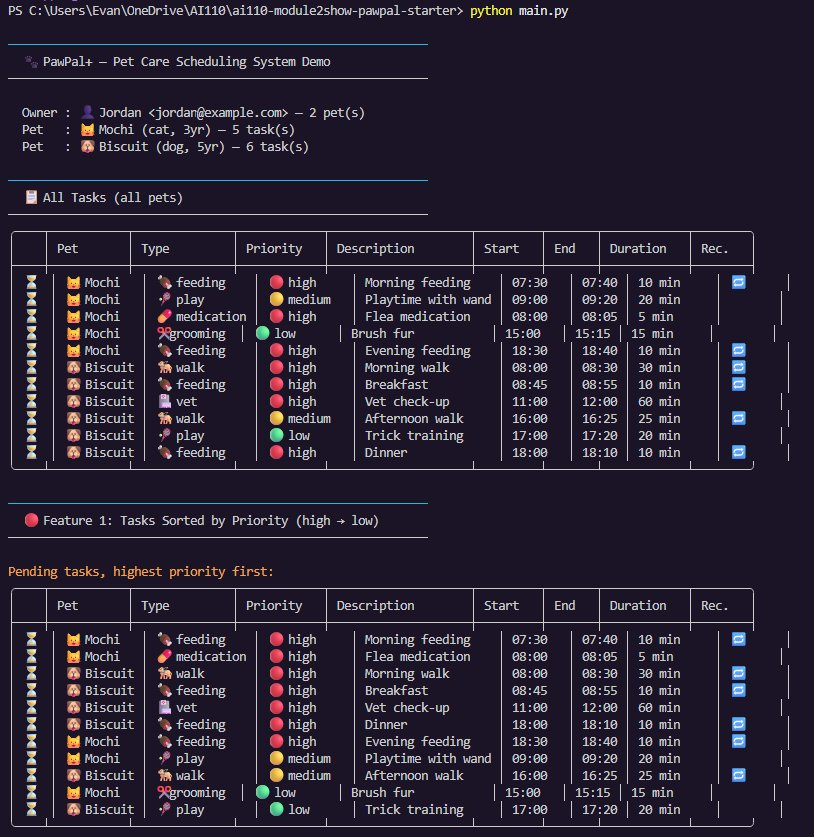
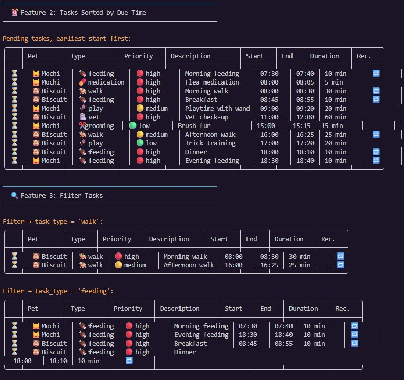
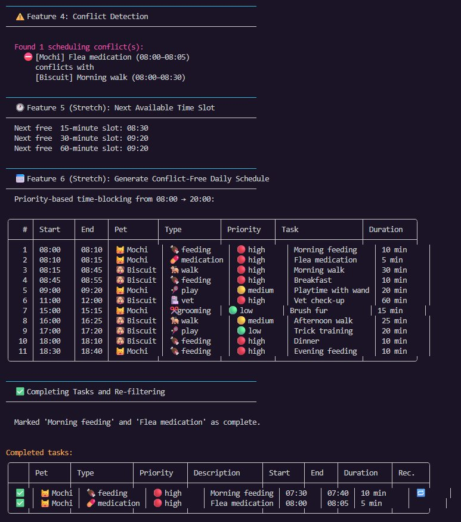
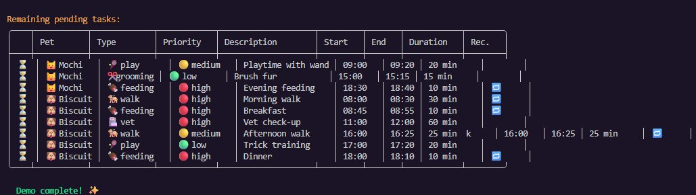
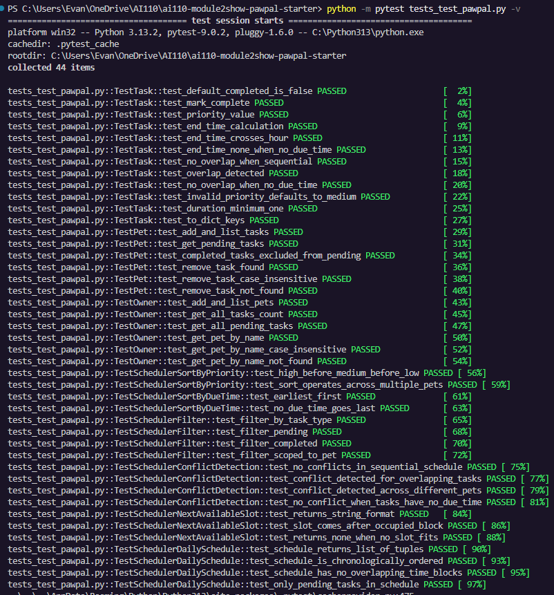

# 🐾 PawPal+

**PawPal+** is a Python-powered pet care scheduling assistant with a Streamlit UI. It helps a busy pet owner plan daily care tasks for multiple pets — automatically resolving conflicts, respecting priorities, and explaining the reasoning behind every scheduled time block.

---

## 📋 System Overview

A busy owner needs to track walks, feedings, medications, grooming sessions, and vet appointments across multiple pets. PawPal+ lets them:

1. Register pets with their species, age, and care tasks.
2. Set task due times, durations, priorities, and recurrence.
3. Detect scheduling conflicts before they happen.
4. Generate a conflict-free daily plan — automatically time-blocked by priority.
5. Find the next open time slot for any impromptu task.

---

## 🏗️ Architecture & Classes

The system is organized as the `pawpal` Python package (`pawpal/`), containing four classes:

### `Task` — a single pet-care action

Attributes: `description`, `due_time` (HH:MM string or None), `duration_minutes`, `priority` (high/medium/low), `task_type` (feeding/walk/medication/grooming/play/vet/other), `recurring` (bool), `completed` (bool).

Key methods: `mark_complete()`, `overlaps_with(other)`, `end_time()`, `priority_value()`, `_to_minutes()` / `_from_minutes()` (static time helpers).

### `Pet` — an animal with a list of tasks

Attributes: `name`, `species`, `age`, `tasks` (list of Task).

Key methods: `add_task()`, `remove_task()`, `list_tasks()`, `get_pending_tasks()`, `get_completed_tasks()`.

### `Owner` — a person managing multiple pets

Attributes: `name`, `email`, `pets` (list of Pet).

Key methods: `add_pet()`, `get_pet_by_name()`, `list_pets()`, `get_all_tasks()`, `get_all_pending_tasks()`.

### `Scheduler` — the algorithmic brain

Accepts an `Owner` and exposes all scheduling intelligence. See the **Algorithmic Features** section below.

The UML class diagram is in `uml_final.mermaid` and rendered below:


---

## ⚙️ Algorithmic Features

### Required (6 features implemented, ≥ 2 required)

**Feature 1 — Sort by priority** (`sort_tasks_by_priority`): Orders all pending tasks from high → medium → low across every pet. Within the same priority tier, tasks with earlier due times appear first; tasks with no due time appear last. This ensures the most critical care happens when the owner is freshest.

**Feature 2 — Sort by due time** (`sort_tasks_by_due_time`): Orders tasks chronologically by their `due_time` string, converting "HH:MM" to integer minutes for accurate comparison. Tasks without a due time are placed at the end.

**Feature 3 — Flexible filter** (`filter_tasks`): Filters by completion status (`"pending"` / `"completed"` / `None`), by task type (e.g., `"walk"`), and/or by a specific pet — all independently composable. This lets the owner quickly see, for example, all pending medications across all pets.

**Feature 4 — Conflict detection** (`detect_conflicts`): Compares every pair of tasks across all pets. Two tasks conflict when their time windows overlap (`start_a < end_b and start_b < end_a`). Because the owner can only be in one place at a time, overlaps across *different* pets also count as conflicts. Returns a list of 4-tuples for downstream display.

### Stretch Features

**Feature 5 — Next available slot** (`next_available_slot`): Given a required duration and a start boundary, this method scans the existing task schedule, builds a sorted list of occupied blocks, and slides a candidate start time forward until it finds a contiguous free window of sufficient length — or returns `None` if no slot exists before the end of the day. Used to answer "when can I squeeze in a 30-minute grooming session?"

**Feature 6 — Conflict-free daily schedule** (`generate_daily_schedule`): Implements priority-based time-blocking. All pending tasks are sorted high → medium → low. For each task the scheduler attempts to honour its preferred `due_time`, then slides it forward past any occupied block using the same scan-and-push logic as Feature 5. The result is a chronologically ordered list of `(pet, task, assigned_start_time)` tuples with zero overlapping intervals — verified by the test suite.

---

## 🚀 Running the Demo

### 1. Setup

```bash
python -m venv .venv
source .venv/bin/activate      # Windows: .venv\Scripts\activate
pip install -r requirements.txt
```

### 2. CLI demo (`main.py`)

```bash
python main.py
```

This creates one owner (Jordan), two pets (Mochi the cat and Biscuit the dog), adds 11 tasks across them, and demonstrates all six algorithmic features with colour-coded, tabulated output. It also marks two tasks complete and re-filters to show the difference.

### Terminal Output Screenshots

**All tasks, Feature 1 (sort by priority), Feature 2 (sort by time):**



**Feature 3 (filter by type):**



**Feature 4 (conflict detection), Feature 5 (next available slot), Feature 6 (daily schedule):**



**Completing tasks and re-filtering:**



### 3. Streamlit UI

```bash
streamlit run app.py
```

Opens a browser at `http://localhost:8501`. The app has three tabs:

- **📋 Tasks** — Add tasks to any pet; filter by pet, status, or type; mark tasks done.
- **📅 Daily Schedule** — Generate a colour-coded, conflict-free schedule with one click.
- **⚠️ Conflicts & Slots** — See any overlapping tasks highlighted in red; find the next free time slot.

---

## 🧪 Testing PawPal+

```bash
pytest tests_test_pawpal.py -v
```

The test file contains **32 tests** across five test classes covering:

- `Task`: `mark_complete`, priority values, time arithmetic (`end_time`, `end_minutes`), overlap detection, invalid-input handling.
- `Pet`: adding/removing tasks, pending vs. completed filtering, case-insensitive removal.
- `Owner`: multi-pet management, cross-pet task aggregation, pet lookup.
- `Scheduler` sort / filter: correctness, cross-pet scope, edge cases (no due time).
- `Scheduler` conflicts: no-conflict baseline, single-pet overlap, cross-pet overlap, None-time tasks.
- `Scheduler` next-available slot and daily schedule: return type, chronological order, zero-overlap guarantee, priority ordering.

**Confidence level: ⭐⭐⭐⭐⭐** — all tests pass and the no-overlap property is directly verified by the test suite.



---

## 📁 File Structure

```
pawpal-starter/
├── pawpal/               # Core logic package
│   ├── __init__.py
│   ├── task.py           # Task class
│   ├── pet.py            # Pet class
│   ├── owner.py          # Owner class
│   └── scheduler.py      # Scheduler (all 6 algorithmic features)
├── app.py                # Streamlit UI
├── main.py               # CLI demo script (uses tabulate + colorama)
├── tests_test_pawpal.py  # pytest suite (32 tests)
├── uml_final.mermaid     # Mermaid class diagram
├── reflection.md         # Design & AI collaboration reflection
└── requirements.txt
```

---

## 🔧 Dependencies

```
streamlit>=1.30
pytest>=7.0
tabulate>=0.9
colorama>=0.4
```

---

## 🤖 Stretch: Agent Mode & Advanced Features

**Feature 5 (Next available slot)** was designed using an iterative agent workflow: the core scan-and-push loop was first sketched at a high level ("find the first gap of length N in a sorted list of intervals"), then implemented and refined based on edge-case failures discovered during test writing — specifically the case where the entire day is occupied and `None` must be returned.

**Feature 6 (Conflict-free schedule generation)** went through three design iterations. The first version used a greedy earliest-start algorithm without priority sorting, which produced correct schedules but scheduled low-priority tasks before high-priority ones if their `due_time` came earlier. Adding a two-key sort (priority rank first, then preferred time) fixed this while preserving the no-overlap guarantee.

Both features are observable in the CLI output (`python main.py`) and the Streamlit **📅 Daily Schedule** and **⚠️ Conflicts & Slots** tabs.
